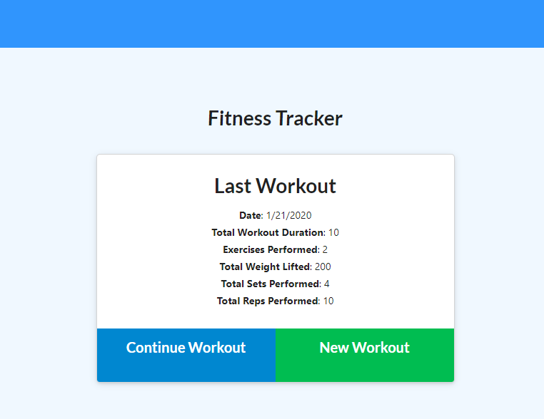
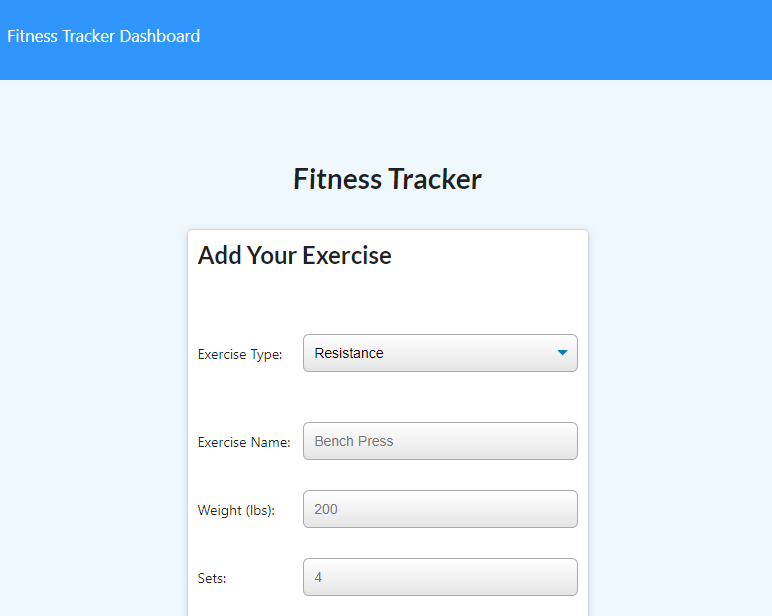
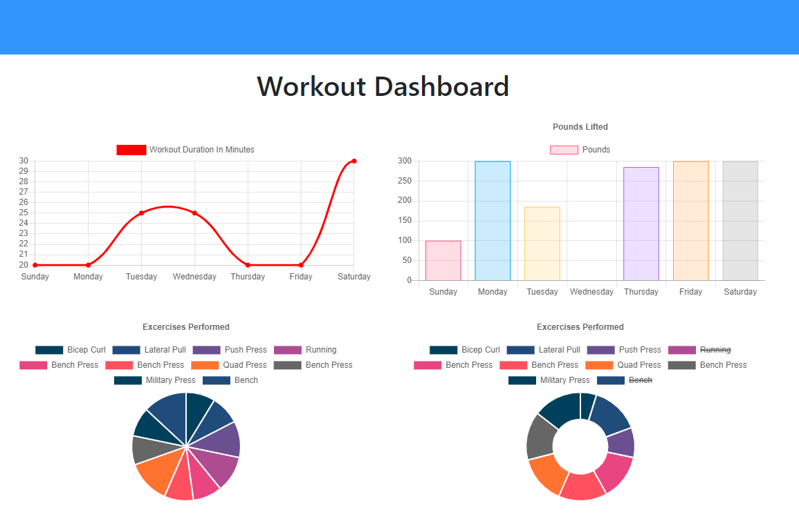

# Fitness Tracker
Allows the user to track a workout. Various attributes of the workout can be stored. The workouts are saved in a Mongo database.

## Live site: 
https://too-fit-to-quit.herokuapp.com/

## Images
Image of main view:

Image of adding exercises:

Image of Workout Dashboard

## Installation 
You will need to npm init to get all the required node modules. If you are running the code locally the local host is set to port 3000. You will also need to go in to the config folder and possibly change the config.json values. The file I used to start the project is server.js.

## Usage 
The primary purpose of this was to meet the requirements of a homework assignment. The major goal seems to be practice with MongoDB and Mongoose You could use it to track a workout, or as the basis of a workout app.
